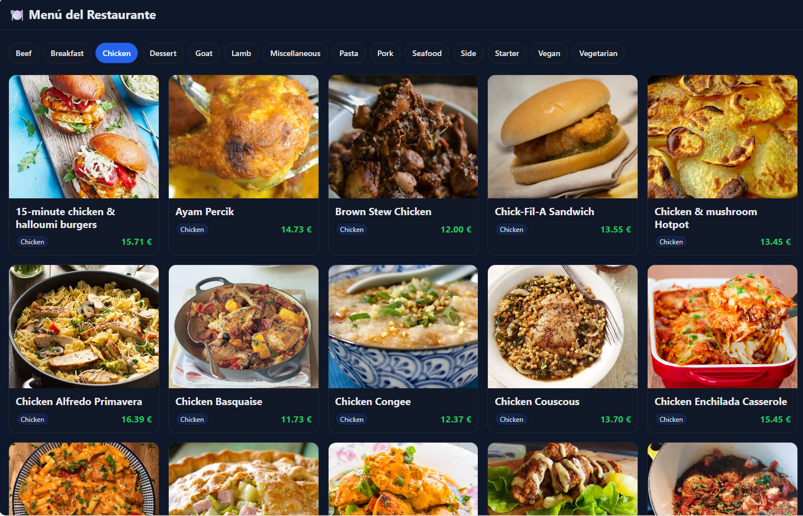
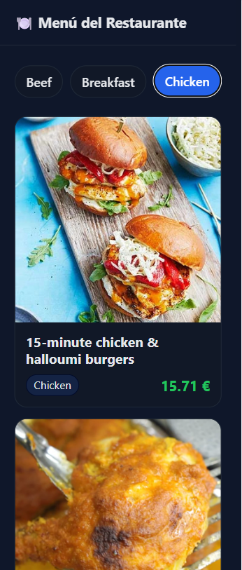

# 🍽️ Proyecto Restaurante - React + Vite

Este proyecto muestra un menú interactivo de un restaurante, con categorías de comidas obtenidas desde la API pública [TheMealDB](https://www.themealdb.com/).  
Permite navegar entre categorías, ver imágenes, precios simulados y adaptar el diseño según el tamaño de pantalla (responsive).

---

## 🚀 Tecnologías usadas
- **React 18**
- **Vite**
- **React Router DOM**
- **CSS Responsive (Flex + Grid)**
- **Fetch API (TheMealDB)**

---

## 📱 Vista previa

### 💻 Versión de escritorio


### 📱 Versión móvil


---

## ⚙️ Instalación y uso

```bash
git clone https://github.com/<tu-usuario>/restaurante-react.git

cd restaurante-react

npm install

npm run dev

npm run build

